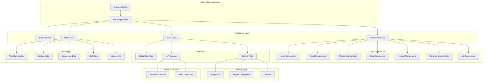
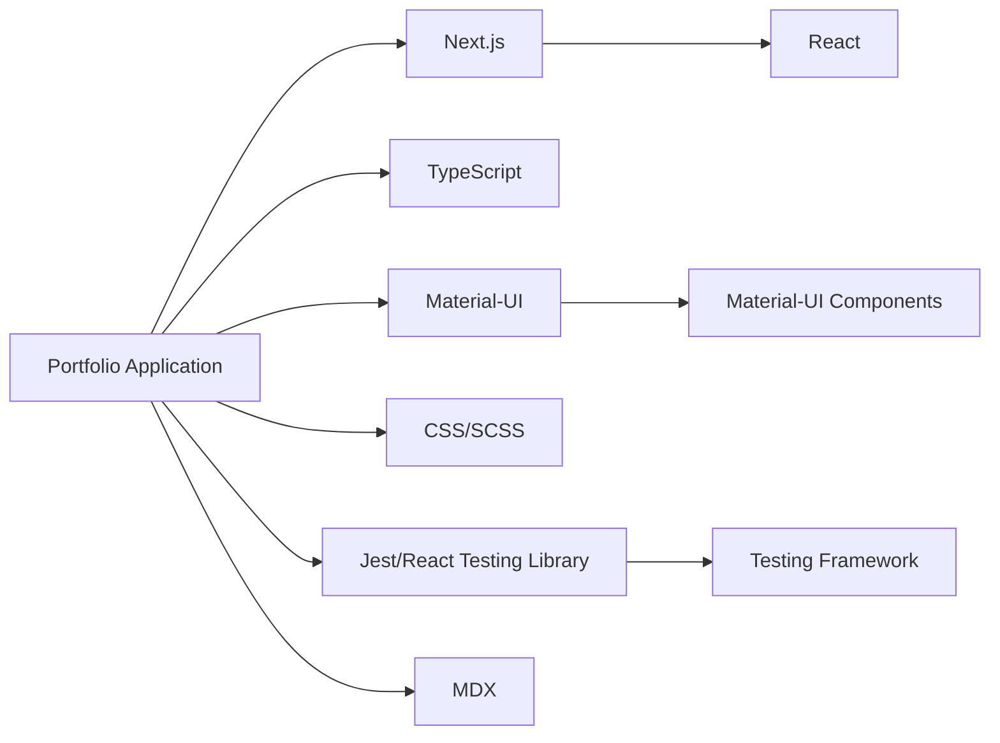
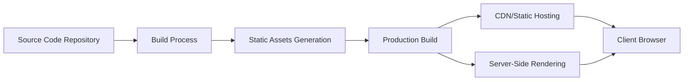
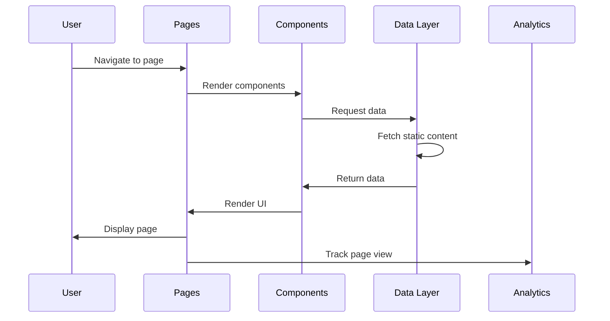

# High-Level Design (HLD) - Portfolio Application

## Overview

This document describes the high-level architecture of the portfolio application built using Next.js, TypeScript, and Material-UI. The application serves as a personal portfolio showcasing skills, experiences, projects, and blog content.

## Architecture Overview

## System Components

### 1. Presentation Layer
- **Pages**: Next.js pages that handle routing and serve as entry points
- **Components**: Reusable UI components organized by functionality
- **Layouts**: Common layouts like header, footer, and navigation

### 2. Business Logic Layer
- **Hooks**: Custom React hooks for managing state and side effects
- **Context**: Global state management for themes, user preferences
- **Services**: API integrations and external service communication

### 3. Data Layer
- **Static Data**: Configuration files containing experience, skills, contact information
- **Content Files**: MDX files for blog posts, projects, and tutorials
- **API Services**: Data fetching and caching mechanisms

## Technology Stack

## Deployment Architecture

## Key Features

### 1. Responsive Design
- Mobile-first approach
- Adaptive layouts for different screen sizes
- Touch-friendly interactions

### 2. Dynamic Content Management
- Content stored in MDX files for easy editing
- Automatic content generation
- SEO-friendly URL patterns

### 3. Performance Optimization
- Server-side rendering (SSR)
- Static site generation (SSG)
- Client-side rendering (CSR) where needed
- Image optimization
- Code splitting

### 4. Theme System
- Light and dark mode support
- Theme persistence across sessions
- Smooth transitions between themes

## Data Flow

## Non-Functional Requirements

### 1. Performance
- Fast loading times (<3s)
- Optimized images and assets
- Efficient caching strategies

### 2. Security
- Client-side only (static hosting)
- No backend authentication required
- Secure content handling

### 3. Scalability
- Static generation allows for horizontal scaling
- CDN distribution for global access
- Minimal server resource requirements

### 4. Maintainability
- Modular, component-based architecture
- Clear separation of concerns
- Comprehensive documentation