# Low-Level Design (LLD) - Portfolio Application

## Overview

This document provides a detailed low-level design of the portfolio application, focusing on component implementations, data structures, and internal logic.

## Component Architecture

### 1. Experience Section Component

#### Class/Component Diagram

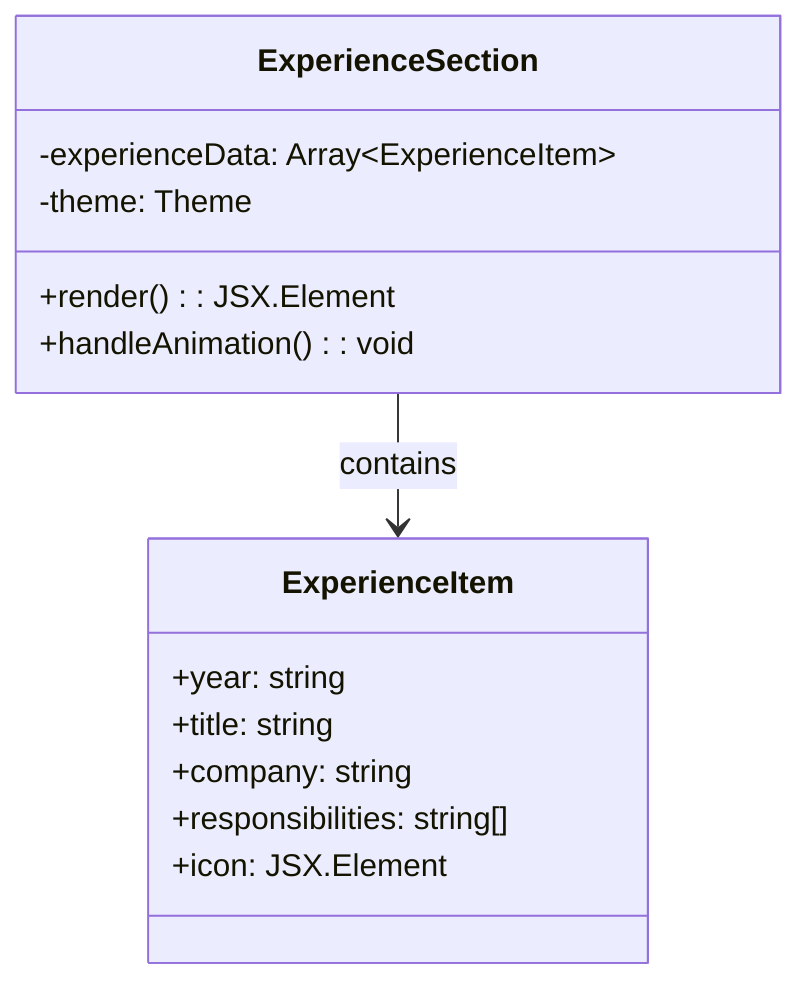

#### Component Implementation Details

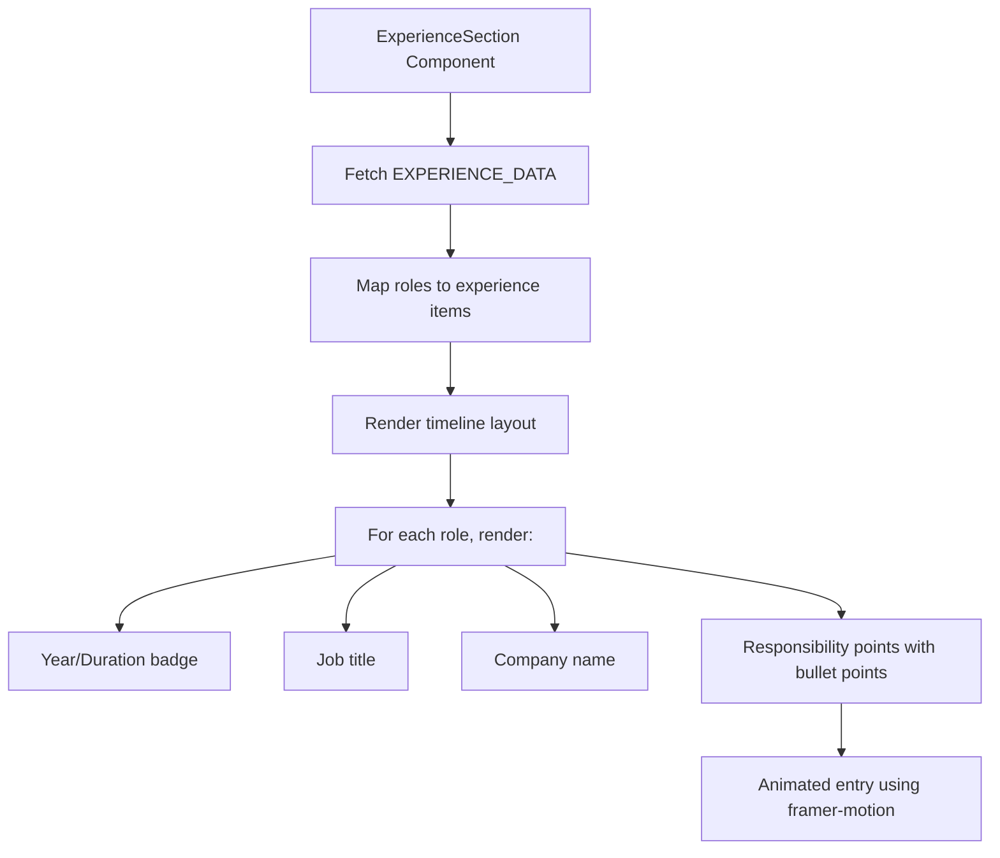

### 2. Data Flow for Experience Section

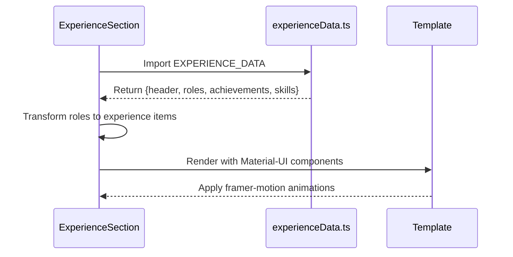

## Data Structures

### 1. Experience Data Structure

```typescript
interface ExperienceRole {
  title: string;
  company: string;
  duration: string; // e.g. "Aug 2022 – Oct 2025"
  location: string;
  responsibilities: string[]; // HTML strings with <strong> tags
  techStack: string[];
}

interface ExperienceData {
  header: {
    title: string;
    subtitle: string;
  };
  roles: ExperienceRole[];
  achievements: string[];
  skills: string[];
}
```

### 2. Component State Management

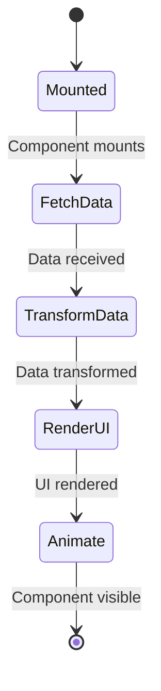

## Implementation Details

### 1. Experience Section Component

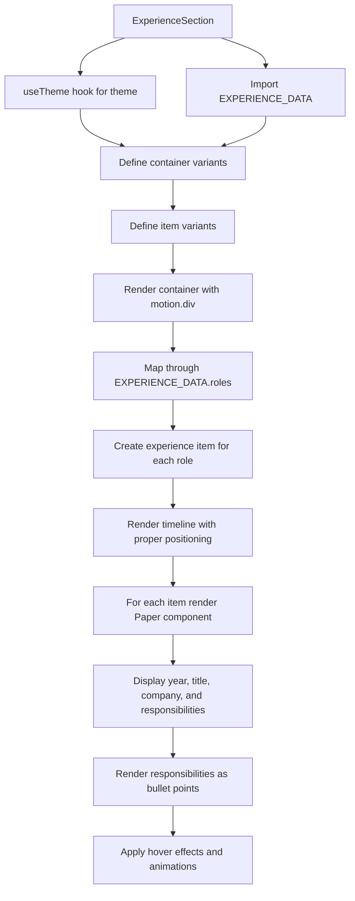

### 2. Data Transformation Logic

The component performs the following transformations:

```typescript
// Input: EXPERIENCE_DATA.roles (array of ExperienceRole)
// Output: experienceData (array of items for UI)

const experienceData = [
  ...EXPERIENCE_DATA.roles.map(role => ({
    year: role.duration,           // duration becomes year
    title: role.title,             // job title
    company: role.company,         // company name
    responsibilities: role.responsibilities, // array of responsibilities
    icon: <Work />                // fixed icon for work experience
  }))
];
```

## UI/UX Implementation

### 1. Timeline Layout

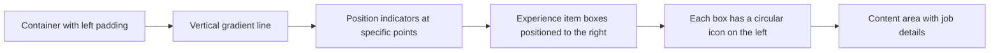

### 2. Responsive Design Strategy

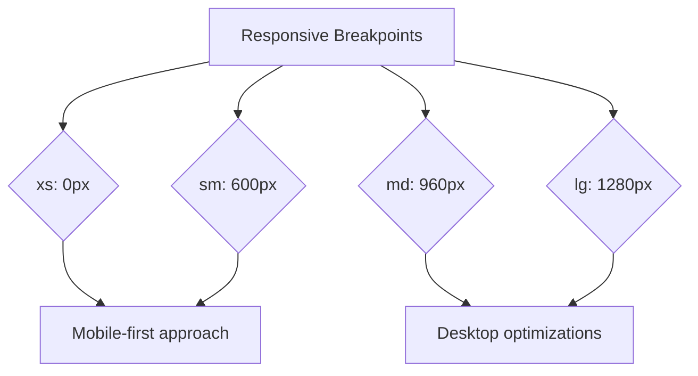

## Animation System

### 1. Framer Motion Implementation

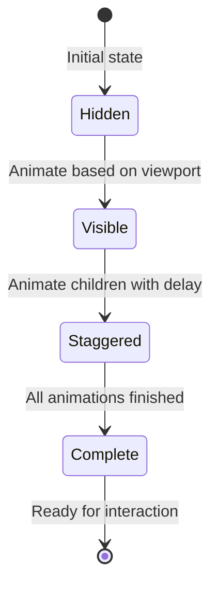

### 2. Animation Variants

```typescript
// Container Variants
containerVariants = {
  hidden: { opacity: 0 },
  visible: {
    opacity: 1,
    transition: {
      staggerChildren: 0.2
    }
  }
}

// Item Variants
itemVariants = {
  hidden: { opacity: 0, x: -20 },
  visible: {
    opacity: 1,
    x: 0,
    transition: {
      duration: 0.5
    }
  }
}
```

## Styling Implementation

### 1. Material-UI Component Styling

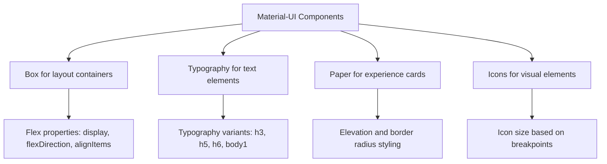

### 2. Theme Integration

```mermaid
graph LR
    A[useTheme Hook] --> B[Primary Color]
    A --> C[Secondary Color]
    A --> D[Mode (light/dark)]
    
    B --> E[Gradient generation]
    C --> E
    D --> F[Background colors]
    D --> G[Text colors]
```

## Error Handling and Edge Cases

### 1. Data Availability

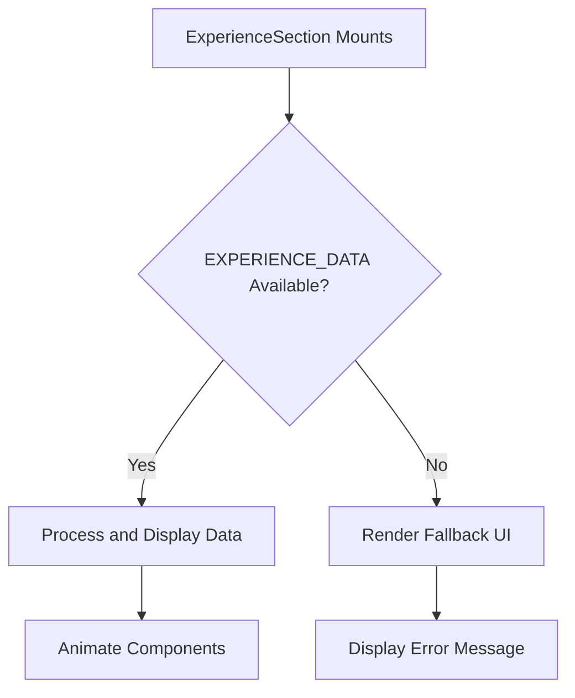

### 2. Responsive Behavior

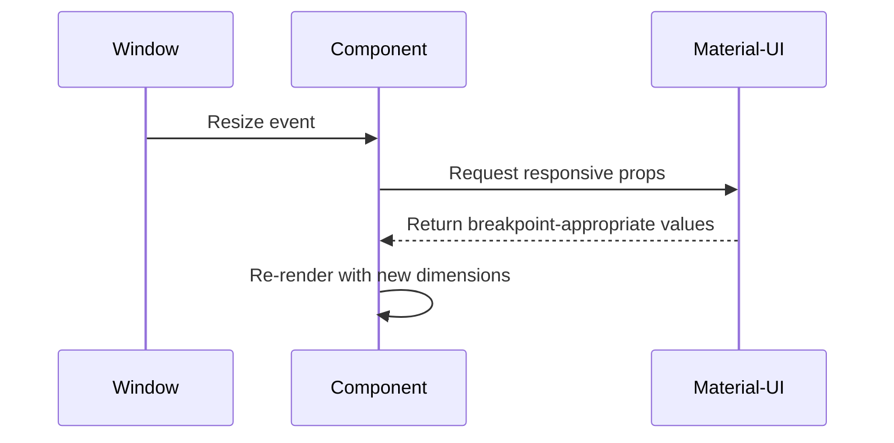

## Performance Optimizations

### 1. Rendering Strategy

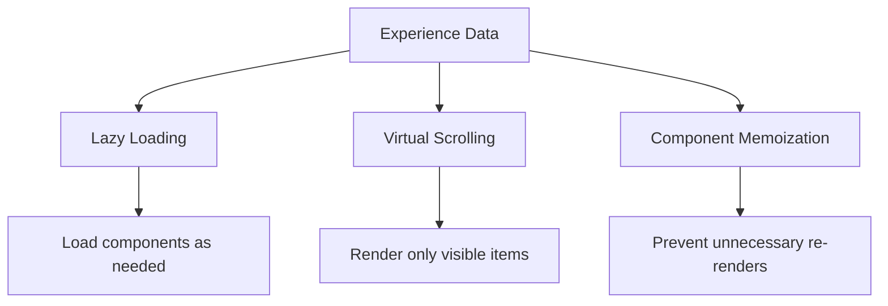

### 2. Memory Management

- Use React.memo for components with stable props
- Clean up event listeners when components unmount
- Optimize SVG icons with proper sizing

## Testing Strategy

### 1. Component Testing

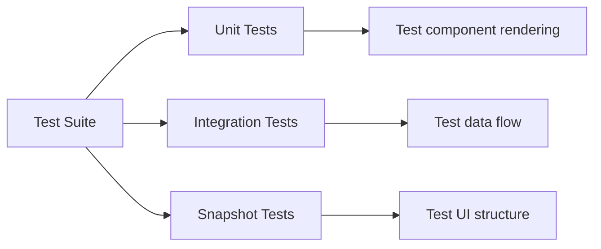

### 2. Specific Test Cases

- Test experience data rendering
- Verify animation behavior
- Validate responsive layouts
- Check accessibility features